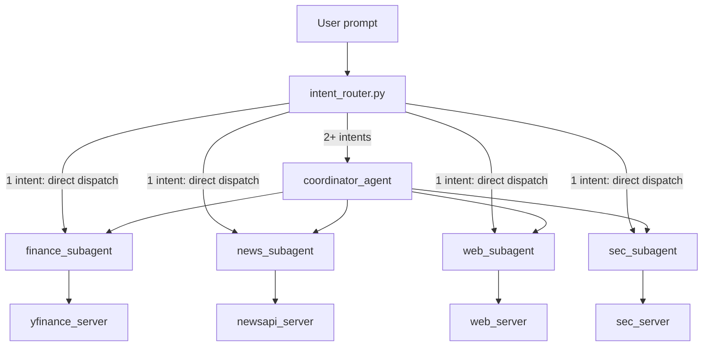

# AI Agents Lab

A hands-on learning lab for building agentic systems with local LLMs, LangChain, and the [Model Context Protocol (MCP)](https://modelcontextprotocol.io/). The repo experiments with how agents plan, call tools, delegate work, and interact with external data — without committing to a single vendor stack.

For the full learning roadmap and reference links, see [blueprint.md](blueprint.md).

## What This Repo Does

The current implementation is a **multi-agent assistant** that runs entirely on your machine (via [Ollama](https://ollama.com/)) and pulls live data from four external domains:

| Domain | Data source | MCP tools |
|--------|-------------|-----------|
| Finance | [yfinance](https://pypi.org/project/yfinance/) (Yahoo Finance) | `stock_quote`, `stock_history` |
| News | [NewsAPI](https://newsapi.org/) | `news_search`, `news_headlines` |
| SEC filings | [SEC EDGAR](https://www.sec.gov/edgar/search/) (`data.sec.gov`) | `sec_lookup_cik`, `sec_recent_filings` |
| Web pages | Allowlisted HTTPS fetch + BeautifulSoup extraction | `fetch_url` |

You can run five entry points:

- **Coordinator agent** — intent router enables relevant specialists each turn; single-intent prompts dispatch directly without a coordinator LLM call
- **Finance agent** — standalone stock and market data assistant
- **News agent** — standalone headlines and topic search assistant
- **SEC agent** — standalone EDGAR filings assistant (10-K, 10-Q, 8-K metadata)
- **Web agent** — standalone allowlisted page fetch and summarize assistant

Each agent session writes a timestamped log to `logs/` with user prompts, `[ROUTER]` decisions (coordinator), tool calls, API requests, and replies.

## Architecture



**Intent routing** (`src/agents/intent_router.py`) scans each user prompt with deterministic keyword and URL matching. It decides which subagents may run for that turn — no extra LLM call. If nothing matches, the default is `finance_subagent` + `news_subagent` only. SEC and web specialists are not enabled unless their keywords or URLs match.

**Layer breakdown:**

1. **Agents** (`src/agents/`) — LangChain `create_agent` loops backed by a local Ollama model. The coordinator caches four specialists at startup and exposes only router-enabled subagents as tools each turn.
2. **MCP servers** (`src/mcp_servers/`) — thin [FastMCP](https://github.com/modelcontextprotocol/python-sdk) wrappers that expose domain tools over stdio.
3. **Data retrieval** (`src/data_retrieval/`) — fetch and format data from Yahoo Finance, NewsAPI, SEC EDGAR, and allowlisted web pages; shared by the MCP servers.
4. **Shared utilities** (`src/agents/agent_utils.py`) — LLM setup, interactive chat loop, session logging, and `[ROUTER]` log lines.

## Prerequisites

- **Python 3.11+**
- **[Ollama](https://ollama.com/download)** running locally with a tool-capable model:

  ```bash
  ollama pull llama3.2
  ```

- **NewsAPI key** (free tier) for the news agent and coordinator news scenarios
- **SEC User-Agent** for the SEC agent — required by [SEC developer policy](https://www.sec.gov/about/developer-resources); use a descriptive value with contact info
- **Web allowlist** — the web agent only fetches HTTPS URLs on domains listed in `WEB_ALLOWED_DOMAINS`

Copy `.env.example` to `.env` and set:

```env
NEWSAPI_API_KEY=your_newsapi_key_here
SEC_USER_AGENT=AI_Agent_Lab/1.0 (your.email@example.com)
WEB_ALLOWED_DOMAINS=sec.gov,apple.com,techcrunch.com,news.ycombinator.com
```

## Setup

```bash
# From the project root
python -m venv .venv

# Windows
.venv\Scripts\activate

pip install -r requirements.txt
```

Verify Ollama is reachable:

```bash
curl http://localhost:11434/api/tags
```

## Running the Agents

Run from the project root so MCP server subprocesses resolve correctly:

```bash
# Multi-agent coordinator with intent routing
python -m src.agents.coordinator_agent

# Standalone specialists
python -m src.agents.finance_agent
python -m src.agents.news_agent
python -m src.agents.sec_agent
python -m src.agents.web_agent
```

Example prompts:

- Coordinator (finance only): *"What is AAPL trading at?"*
- Coordinator (news only): *"Latest Apple headlines"*
- Coordinator (SEC only): *"Recent 10-K filings for AAPL"*
- Coordinator (web only): *"Open this link https://www.apple.com and summarize the page"*
- Coordinator (mixed): *"What is AAPL trading at and any recent Apple news?"*
- Finance: *"What is MSFT trading at?"*
- News: *"Latest AI headlines"*
- SEC: *"Show recent 10-Q filings for MSFT"*
- Web: *"Fetch https://techcrunch.com and summarize the page text"*

Type `quit` or `exit` to end a session. Logs are written to `logs/<session_name>_<timestamp>.logs`. Coordinator logs include lines like `[ROUTER] enabled_subagents=['finance_subagent']`.

## Testing

```bash
# Unit tests (no Ollama)
python tests/test_intent_router.py

# MCP server smoke tests
python tests/test_newsapi_mcp.py
python tests/test_sec_mcp.py
python tests/test_web_mcp.py

# Coordinator integration test (requires Ollama; news and optional SEC env vars)
python tests/test_coordinator_delegation.py
```

The SEC MCP smoke test and coordinator `sec_only` scenario skip live SEC calls when `SEC_USER_AGENT` is not set.

## Project Layout

```
AI_agent_lab/
├── blueprint.md                 # Learning path, references, and target architecture
├── README.md                    # This file
├── .env.example                 # NEWSAPI_API_KEY, SEC_USER_AGENT, WEB_ALLOWED_DOMAINS
├── requirements.txt             # Pinned Python dependencies
├── logs/                        # Session and test logs (gitignored)
├── src/
│   ├── agents/
│   │   ├── agent_utils.py       # LLM, logging, interactive loop
│   │   ├── coordinator_agent.py # Routed multi-agent orchestrator
│   │   ├── intent_router.py     # Keyword/URL subagent gating
│   │   ├── finance_agent.py     # Standalone finance agent
│   │   ├── news_agent.py        # Standalone news agent
│   │   ├── sec_agent.py         # Standalone SEC filings agent
│   │   └── web_agent.py         # Standalone allowlisted web fetch agent
│   ├── data_retrieval/
│   │   ├── yfinance_client.py   # Stock quote and history fetching
│   │   ├── newsapi_client.py    # News search and headlines fetching
│   │   ├── sec_client.py        # EDGAR ticker lookup and recent filings
│   │   └── web_client.py        # Allowlisted HTTPS fetch and text extraction
│   ├── mcp_servers/
│   │   ├── yfinance_server.py   # MCP server for stock tools
│   │   ├── newsapi_server.py    # MCP server for news tools
│   │   ├── sec_server.py        # MCP server for SEC tools
│   │   └── web_server.py        # MCP server for fetch_url
│   └── experiments/
│       └── 01-ollama-chat/      # Early Ollama connectivity check
└── tests/
    ├── test_intent_router.py           # Router unit tests
    ├── test_newsapi_mcp.py             # NewsAPI MCP smoke test
    ├── test_sec_mcp.py                 # SEC MCP smoke test
    ├── test_web_mcp.py                 # Web MCP smoke test
    └── test_coordinator_delegation.py  # Routed coordinator integration test
```

## Core Stack

| Tool | Role |
|------|------|
| [Ollama](https://docs.ollama.com/quickstart) | Run LLMs locally (free, private) |
| [LangChain / LangGraph](https://docs.langchain.com/oss/python/langchain/overview) | Agent harness, tools, orchestration |
| [langchain-mcp-adapters](https://github.com/langchain-ai/langchain-mcp-adapters) | Bridge MCP tools into LangChain agents |
| [MCP](https://modelcontextprotocol.io/docs/develop/build-server) | Standard protocol for exposing tools to agents |
| [BeautifulSoup](https://www.crummy.com/software/BeautifulSoup/) | HTML text extraction for the web agent |

## References

- [Ollama quickstart](https://docs.ollama.com/quickstart)
- [Build an MCP server (Python)](https://modelcontextprotocol.io/docs/develop/build-server)
- [LangChain MCP integration](https://docs.langchain.com/oss/python/langchain/mcp)
- [SEC developer resources](https://www.sec.gov/about/developer-resources)
